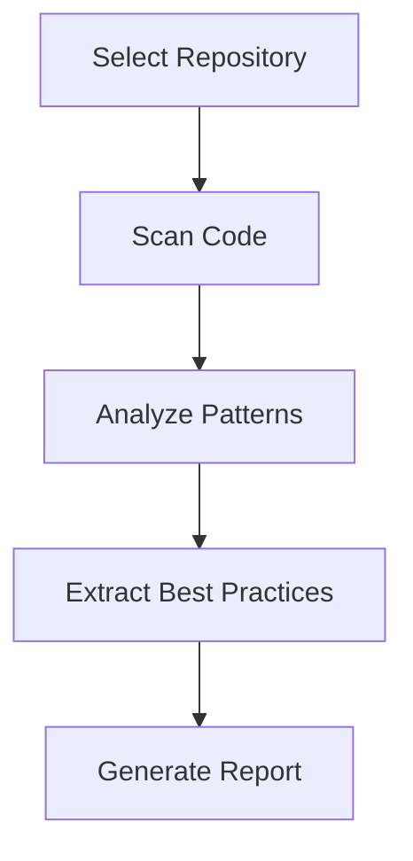
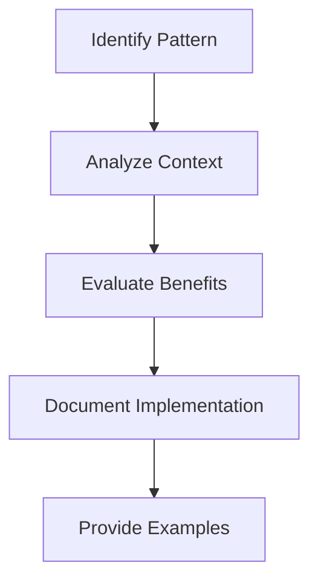

# 🔍 Obsidian Plugin Analyzer

A tool for analyzing Obsidian plugins to extract best practices, patterns, and learning.

## 🎯 Features

- Code pattern analysis
- Issue and PR analysis
- Best practice extraction
- Performance metrics
- Documentation quality assessment
- Test coverage analysis

## 📋 Requirements

- Node.js 16+
- GitHub Personal Access Token
- TypeScript 4.4+
- npm or yarn

## 🚀 Installation

1. Install dependencies:
```bash
npm install
```

2. Set up GitHub token:
```bash
export GITHUB_TOKEN=your_token_here
```

## 📝 Usage

### Analyze a Plugin

```bash
npm run analyze -- <github-token> <owner> <repo>
```

Example:
```bash
npm run analyze -- ghp_xyz123 obsidianmd dataview
```

### Analysis Output

The analyzer generates a detailed report in the `analysis-results` directory with:

1. Code Patterns
- Class patterns
- Function patterns
- Error handling patterns
- Testing patterns

2. Community Analysis
- Common issues
- Feature requests
- User feedback
- Pull request patterns

3. Best Practices
- Implementation patterns
- Error handling
- Testing approaches
- Documentation standards

4. Metrics
- Code quality
- Test coverage
- Documentation completeness
- Performance indicators

## 📊 Report Structure

```markdown
# Plugin Analysis Report

## Overview
- Repository information
- Analysis date
- Plugin type

## Patterns Found
- Class patterns
- Function patterns
- Error handling
- Testing approaches

## Best Practices
- Implementation guidelines
- Error handling strategies
- Testing methodologies
- Documentation standards

## Metrics
- Code quality score
- Test coverage percentage
- Documentation completeness
- Performance metrics
```

## 🔄 Analysis Process

1. Repository Analysis


2. Pattern Analysis


## 📈 Metrics

### Code Quality
- Type safety
- Error handling
- Code organization
- Documentation

### Test Coverage
- Unit tests
- Integration tests
- Edge cases
- Error scenarios

### Documentation
- API documentation
- Usage examples
- Error handling
- Configuration

### Performance
- Load time
- Memory usage
- CPU usage
- Response time

## 🛠️ Customization

### Adding Custom Patterns

```typescript
class CustomPatternAnalyzer extends PluginAnalyzer {
  protected async analyzeCustomPatterns(): Promise<void> {
    // Implement custom pattern analysis
  }
}
```

### Custom Metrics

```typescript
interface CustomMetrics extends AnalysisMetrics {
  customMetric1: number;
  customMetric2: number;
}
```

## 📋 Best Practice Categories

1. Implementation
- Type safety
- Error handling
- State management
- Performance optimization

2. Testing
- Unit testing
- Integration testing
- Edge case coverage
- Performance testing

3. Documentation
- API documentation
- Usage examples
- Configuration
- Troubleshooting

4. Architecture
- Component organization
- Data flow
- Error handling
- State management

## 🔍 Example Analysis

### Pattern Example
```typescript
// Good Pattern
class FeatureManager {
  private features: Map<string, Feature>;

  constructor() {
    this.features = new Map();
  }

  async enableFeature(name: string): Promise<void> {
    try {
      const feature = this.features.get(name);
      if (!feature) {
        throw new Error(`Feature ${name} not found`);
      }
      await feature.enable();
    } catch (error) {
      console.error(`Failed to enable feature ${name}:`, error);
      throw error;
    }
  }
}
```

### Best Practice Example
```typescript
// Error Handling Best Practice
async function safeOperation<T>(
  operation: () => Promise<T>,
  errorHandler?: (error: Error) => void
): Promise<T> {
  try {
    return await operation();
  } catch (error) {
    if (errorHandler) {
      errorHandler(error as Error);
    }
    throw error;
  }
}
```

## 🤝 Contributing

1. Fork the repository
2. Create your feature branch
3. Add your changes
4. Submit a pull request

## 📝 License

MIT License

## 🔄 Updates

Last Updated: 2025-07-09 