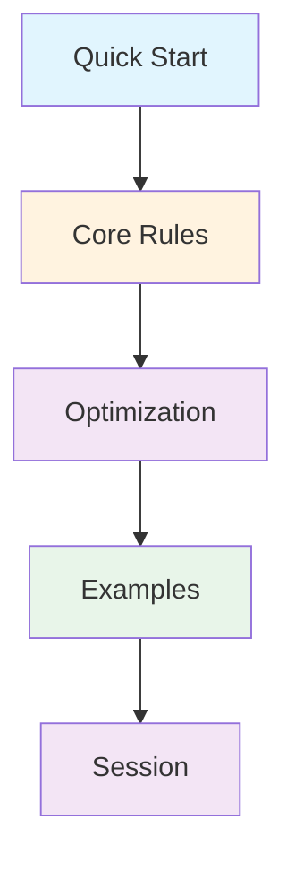

# 🤖 AI Collaboration Framework

## 📚 Framework Components

### 1. Quick Start
- [`ai-quickstart.md`](ai-quickstart.md): Start here for rapid onboarding
- Essential guidelines and workflows
- Common patterns and practices
- Emergency procedures

### 2. Core Rules
- [`ai-collaboration-rules.md`](ai-collaboration-rules.md): Complete ruleset
- Mandatory requirements
- Prohibited practices
- Validation criteria

### 3. Optimization Guide
- [`ai-collaboration-optimization.md`](ai-collaboration-optimization.md): Efficiency patterns
- Resource management
- Token optimization
- Context handling

### 4. Practical Examples
- [`ai-collaboration-examples.md`](ai-collaboration-examples.md): Real-world usage
- Query patterns
- Response formats
- Implementation examples

### 5. Session Management
- [`session-template.md`](session-template.md): Session structure
- Progress tracking
- Decision documentation
- State management

## 🔄 Workflow Overview



## 📋 Required Reading Order

1. `ai-quickstart.md`
2. `ai-collaboration-rules.md`
3. `ai-collaboration-optimization.md`
4. `ai-collaboration-examples.md`
5. `session-template.md`

## 🎯 Framework Goals

### 1. Quality Assurance
- 100% type safety
- >80% test coverage
- 100% documentation
- 100% error handling

### 2. Resource Optimization
- Efficient token usage
- Context management
- State persistence
- Performance optimization

### 3. Collaboration Enhancement
- Clear communication
- Consistent patterns
- Validated changes
- Documented decisions

## 🔍 Framework Usage

### 1. Session Start
```markdown
1. Read framework documentation
2. Create session from template
3. Define objectives
4. Plan implementation
```

### 2. During Development
```markdown
1. Follow rules strictly
2. Optimize resource usage
3. Validate continuously
4. Document progress
```

### 3. Session End
```markdown
1. Verify changes
2. Update documentation
3. Record metrics
4. Plan next steps
```

## 📈 Success Metrics

### 1. Code Quality
```markdown
□ Type safety
□ Error handling
□ Test coverage
□ Documentation
```

### 2. Process Quality
```markdown
□ Session management
□ Progress tracking
□ Decision documentation
□ Resource optimization
```

## 🛠️ Framework Tools

### 1. Documentation
- Session templates
- Example patterns
- Validation checklists
- Progress tracking

### 2. Development
- Code search
- File operations
- Testing utilities
- Documentation generators

## 🔄 Maintenance

### 1. Framework Updates
- Regular review
- Pattern optimization
- Example enhancement
- Documentation updates

### 2. Quality Control
- Usage monitoring
- Pattern validation
- Resource tracking
- Success metrics

## 📚 Additional Resources

### 1. Project Documentation
- Architecture guides
- Development patterns
- Testing strategies
- Performance optimization

### 2. Reference Materials
- TypeScript best practices
- Testing patterns
- Documentation standards
- Performance guidelines

## 🎯 Next Steps

1. Read `ai-quickstart.md`
2. Review rules and requirements
3. Study optimization patterns
4. Examine practical examples
5. Create first session

Remember:
- Follow the rules strictly
- Optimize resource usage
- Validate all changes
- Document everything
- Maintain quality standards

Last Updated: 2025-07-09 