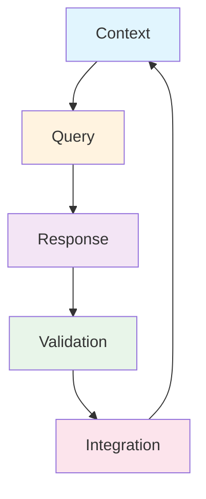
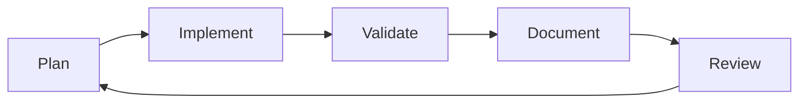
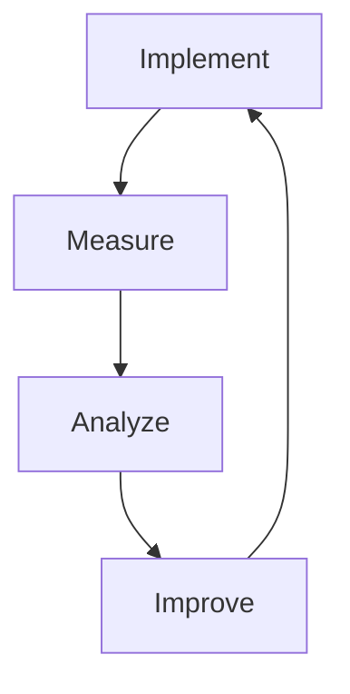

# 🤝 AI Collaboration Optimization Guide

## 🎯 Core Principles

### 1. Structured Information Flow


### 2. Query Optimization Patterns

#### ✅ Effective Patterns
- **Atomic Tasks**: Break complex tasks into smaller, focused units
- **Context Layering**: Build context progressively, not all at once
- **Validation Steps**: Include verification points in the workflow
- **State Management**: Keep track of the current development state
- **Incremental Progress**: Build features iteratively with feedback loops

#### ❌ Anti-Patterns to Avoid
- Overloading context in a single query
- Ambiguous or overly broad requests
- Skipping validation steps
- Losing development state between sessions
- Attempting too many changes at once

## 🔄 Workflow Optimization

### 1. Context Management

#### Before Query
```markdown
- Review current state
- Identify specific needs
- Gather relevant files/code
- Define clear objectives
```

#### During Query
```markdown
- Focus on single responsibility
- Provide necessary context
- Include validation criteria
- Set clear expectations
```

#### After Response
```markdown
- Validate changes
- Document decisions
- Update project state
- Plan next steps
```

### 2. Resource Usage Optimization

#### Token Efficiency
- **Prioritize Information**:
  ```markdown
  1. Essential context first
  2. Relevant code snippets
  3. Specific requirements
  4. Expected outcomes
  ```

- **Context Compression**:
  ```markdown
  Instead of: "I have a TypeScript file that contains a class that implements an interface..."
  Use: "TypeScript class implementing IPlugin interface"
  ```

#### Memory Management
- **State Persistence**:
  ```typescript
  // Document current state
  interface DevelopmentState {
    currentFeature: string;
    completedSteps: string[];
    pendingTasks: string[];
    knownIssues: string[];
  }
  ```

- **Context Restoration**:
  ```markdown
  1. Save key decisions
  2. Document architecture choices
  3. Track implementation progress
  4. Maintain task continuity
  ```

## 📋 Query Templates

### 1. Feature Implementation
```markdown
Context: [Specific feature name]
Current state: [Implementation progress]
Files affected: [List of files]
Next step: [Specific task]
Expected outcome: [Clear criteria]
```

### 2. Code Review
```markdown
Files changed: [List of files]
Focus areas: [Specific aspects]
Current concerns: [Known issues]
Review criteria: [Expected standards]
```

### 3. Debugging
```markdown
Issue description: [Specific problem]
Current behavior: [What's happening]
Expected behavior: [What should happen]
Relevant code: [Minimal example]
Attempted solutions: [What's been tried]
```

## 🔍 Validation Strategies

### 1. Code Quality
```typescript
// Validation checklist
interface CodeValidation {
  typeChecks: boolean;
  testCoverage: boolean;
  errorHandling: boolean;
  documentation: boolean;
}
```

### 2. Implementation Verification
```markdown
1. Type safety ✓
2. Error handling ✓
3. Test coverage ✓
4. Documentation ✓
5. Performance impact ✓
```

## 📈 Progress Tracking

### 1. Development Lifecycle


### 2. Task Management
```markdown
#### Current Sprint
- [x] Feature specification
- [x] Implementation plan
- [ ] Code development
- [ ] Testing
- [ ] Documentation
```

## 🛠️ Best Practices

### 1. Query Construction
- Be specific and focused
- Include relevant context
- Define clear objectives
- Specify validation criteria

### 2. Response Processing
- Validate changes immediately
- Document key decisions
- Update project state
- Plan next steps

### 3. State Management
- Track development progress
- Document architecture decisions
- Maintain context between sessions
- Log important changes

## 📚 Documentation Strategy

### 1. Implementation Notes
```markdown
Feature: [Name]
Status: [Progress]
Key Decisions:
- [Decision 1]
- [Decision 2]
Dependencies:
- [Dependency 1]
- [Dependency 2]
```

### 2. Architecture Decisions
```markdown
Decision: [Description]
Context: [Background]
Consequences:
- [Pro/Con 1]
- [Pro/Con 2]
Status: [Current state]
```

## 🎯 Success Metrics

### 1. Efficiency Indicators
- Query clarity score
- Response accuracy rate
- Implementation speed
- Validation success rate

### 2. Quality Metrics
- Code quality score
- Test coverage
- Documentation completeness
- Performance impact

## 🔄 Continuous Improvement

### 1. Learning Loop


### 2. Optimization Areas
- Query construction
- Context management
- Response validation
- State tracking
- Documentation

## 📊 Resource Management

### 1. Token Optimization
```markdown
Priority levels:
1. Critical context
2. Implementation details
3. Background information
4. Optional enhancements
```

### 2. Context Efficiency
```markdown
Include:
✓ Relevant code
✓ Specific requirements
✓ Current state
✓ Expected outcome

Exclude:
✗ Redundant information
✗ Historical context
✗ Unrelated details
✗ Future considerations
```

## 🔍 Review Process

### 1. Implementation Review
```markdown
- Type safety
- Error handling
- Test coverage
- Documentation
- Performance
```

### 2. Quality Assurance
```markdown
- Code standards
- Best practices
- Security checks
- Performance tests
```

## 📈 Progress Monitoring

### 1. Development Metrics
```markdown
- Implementation speed
- Code quality
- Test coverage
- Documentation completeness
```

### 2. Collaboration Efficiency
```markdown
- Query clarity
- Response accuracy
- Iteration speed
- Resource usage
```

Last Updated: 2025-07-09 