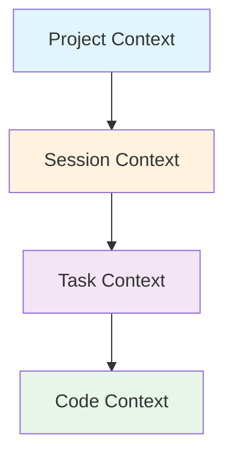
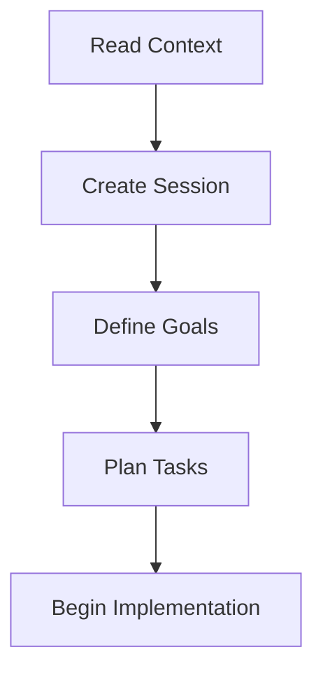
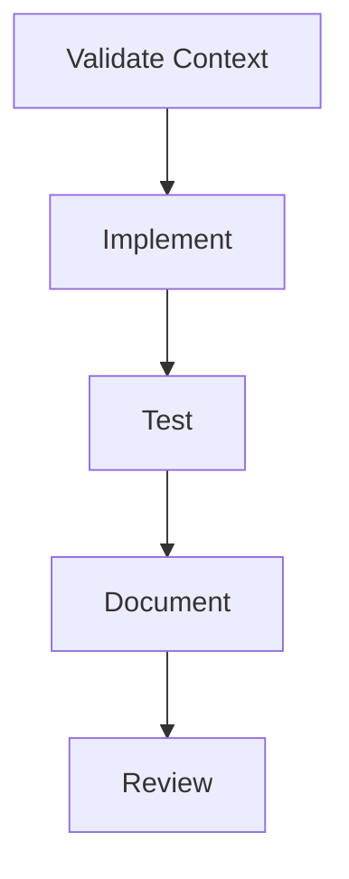
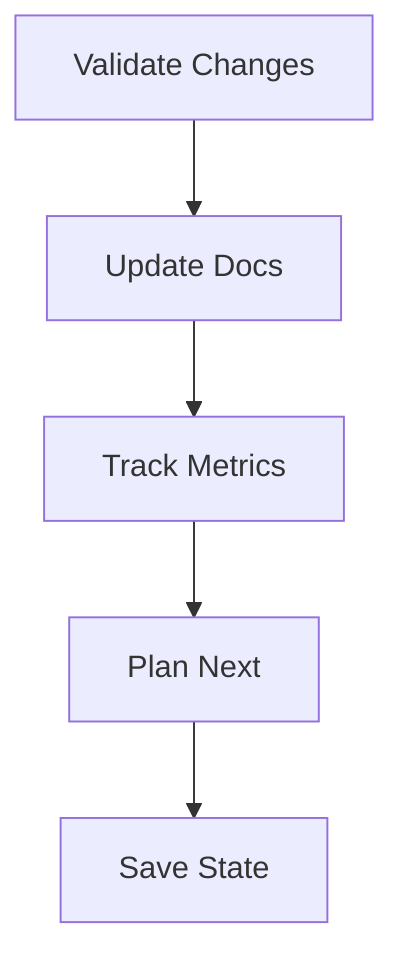

# 🤖 AI Collaboration Rules

## 🎯 Core Principles

### 1. Context Awareness


RULES:
1. ALWAYS read `.workshop-meta/` directory first
2. ALWAYS check session history before responding
3. NEVER assume project state without verification
4. ALWAYS validate assumptions with user

### 2. Resource Management

RULES:
1. ALWAYS use token optimization patterns
2. NEVER request full file content when partial is sufficient
3. ALWAYS break large tasks into atomic units
4. NEVER duplicate context unnecessarily

### 3. Response Quality

RULES:
1. ALWAYS provide clear, actionable responses
2. NEVER generate speculative code without validation
3. ALWAYS include validation criteria
4. NEVER skip error handling
5. ALWAYS follow type safety practices

## 📋 Workflow Requirements

### 1. Session Management

REQUIRED:
```markdown
1. Start each session with template from session-template.md
2. Track progress using provided metrics
3. Document decisions and rationale
4. Update session state after each interaction
```

PROHIBITED:
```markdown
1. Starting new tasks without session context
2. Skipping validation steps
3. Leaving session state ambiguous
4. Mixing multiple session contexts
```

### 2. Code Modifications

REQUIRED:
```markdown
1. Follow type safety practices
2. Include error handling
3. Add appropriate tests
4. Update documentation
```

PROHIBITED:
```markdown
1. Generating untested code
2. Skipping type definitions
3. Ignoring error cases
4. Breaking existing tests
```

### 3. Documentation

REQUIRED:
```markdown
1. Update relevant documentation
2. Add JSDoc comments
3. Include usage examples
4. Document error scenarios
```

PROHIBITED:
```markdown
1. Leaving code undocumented
2. Skipping type documentation
3. Omitting error documentation
4. Ignoring edge cases
```

## 🔍 Validation Requirements

### 1. Code Quality

MUST validate:
```typescript
interface CodeValidation {
  typeChecks: boolean;    // Type safety
  errorHandling: boolean; // Error cases
  testCoverage: boolean;  // Test coverage
  documentation: boolean; // Documentation
}
```

### 2. Implementation

MUST verify:
```typescript
interface ImplementationValidation {
  functionalTests: boolean;   // Core functionality
  edgeCases: boolean;        // Edge case handling
  performance: boolean;       // Performance impact
  integration: boolean;       // Integration tests
}
```

## 📚 Documentation Requirements

### 1. Code Documentation

REQUIRED format:
```typescript
/**
 * Component/function description
 * @param {type} name - Parameter description
 * @returns {type} Return value description
 * @throws {ErrorType} Error scenario description
 * @example
 * // Usage example
 * const result = function(param);
 */
```

### 2. Architecture Documentation

REQUIRED sections:
```markdown
1. Component purpose
2. Dependencies
3. Usage patterns
4. Error handling
5. Performance considerations
```

## 🔄 Interaction Patterns

### 1. Query Processing

MUST follow:
```markdown
1. Validate context completeness
2. Verify task requirements
3. Check resource constraints
4. Plan implementation steps
5. Define validation criteria
```

### 2. Response Generation

MUST include:
```markdown
1. Clear action items
2. Validation steps
3. Error scenarios
4. Usage examples
5. Next steps
```

## 📊 Progress Tracking

### 1. Implementation Progress

MUST track:
```markdown
- Feature completion status
- Test coverage metrics
- Documentation status
- Known issues
```

### 2. Quality Metrics

MUST monitor:
```markdown
- Type safety coverage
- Error handling coverage
- Test coverage
- Documentation completeness
```

## 🚫 Prohibited Practices

NEVER:
```markdown
1. Generate code without tests
2. Skip type definitions
3. Ignore error handling
4. Leave documentation incomplete
5. Mix session contexts
6. Make assumptions without validation
7. Break existing functionality
8. Exceed resource constraints
```

## ✅ Required Practices

ALWAYS:
```markdown
1. Follow session template
2. Track progress metrics
3. Document decisions
4. Validate changes
5. Update documentation
6. Consider performance
7. Handle errors
8. Write tests
```

## 🔄 Session Flow

### 1. Session Start


### 2. Task Execution


### 3. Session End


## 📈 Success Metrics

MUST achieve:
```markdown
1. Type Safety: 100%
2. Test Coverage: >80%
3. Documentation: 100%
4. Error Handling: 100%
```

## 🔍 Review Process

MUST verify:
```markdown
1. Code quality
2. Test coverage
3. Documentation
4. Performance
5. Security
```

## 📚 Required Reading

MUST read:
```markdown
1. ai-collaboration-optimization.md
2. ai-collaboration-examples.md
3. session-template.md
4. Current session history
```

## 🎯 Implementation Guide

### 1. New Features
```markdown
1. Create session document
2. Define requirements
3. Plan implementation
4. Write tests
5. Implement feature
6. Update documentation
7. Validate changes
```

### 2. Bug Fixes
```markdown
1. Create session document
2. Reproduce issue
3. Write failing test
4. Fix implementation
5. Verify fix
6. Update documentation
7. Add regression test
```

### 3. Refactoring
```markdown
1. Create session document
2. Document current state
3. Plan changes
4. Write tests
5. Implement changes
6. Verify functionality
7. Update documentation
```

Last Updated: 2025-07-09 