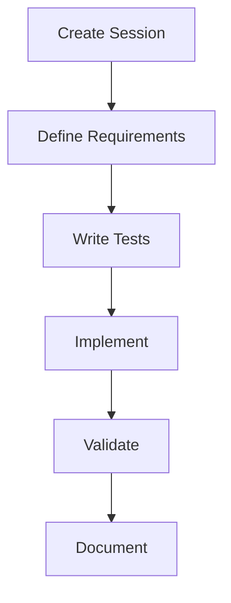
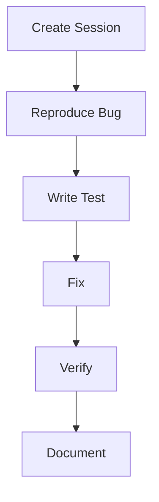
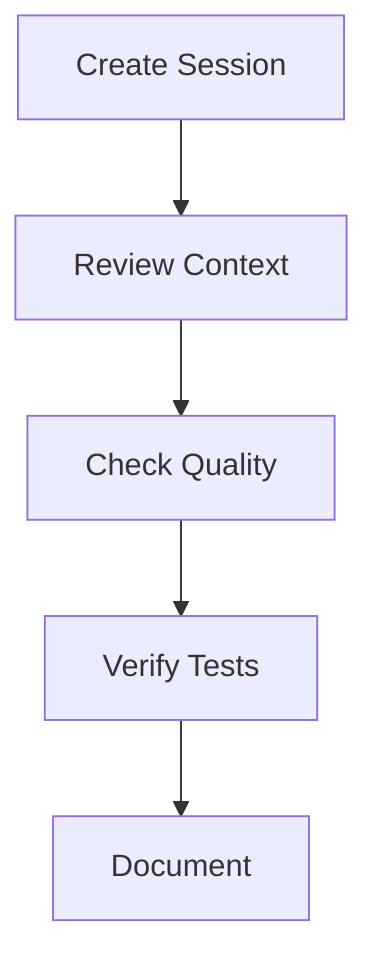

# 🚀 AI Collaboration Quick Start Guide

## 1. First Steps

### Required Reading Order
1. This quick-start guide
2. `ai-collaboration-rules.md`
3. `ai-collaboration-optimization.md`
4. `ai-collaboration-examples.md`
5. `session-template.md`

### Initial Setup
1. Review project structure
2. Check current session context
3. Validate available tools
4. Verify access permissions

## 2. Session Management

### Starting a New Session
```markdown
1. Create session document from template
2. Set clear objectives
3. Document current context
4. Plan implementation steps
```

### During Session
```markdown
1. Track progress continuously
2. Validate each step
3. Document decisions
4. Update session state
```

### Ending Session
```markdown
1. Verify all changes
2. Update documentation
3. Record metrics
4. Plan next steps
```

## 3. Quick Reference

### Must Do
```markdown
✓ Read .workshop-meta/ first
✓ Use session template
✓ Track progress
✓ Validate changes
✓ Document decisions
```

### Must Not Do
```markdown
✗ Skip validation
✗ Ignore session context
✗ Make assumptions
✗ Leave tasks incomplete
✗ Mix contexts
```

## 4. Common Workflows

### Feature Implementation


### Bug Fixing


### Code Review


## 5. Resource Management

### Token Optimization
```markdown
Priority order:
1. Critical context
2. Implementation details
3. Supporting information
4. Optional content
```

### Context Management
```markdown
Required:
- Current task state
- Relevant code
- Test status
- Documentation needs
```

## 6. Quality Checklist

### Code Quality
```markdown
□ Type safety
□ Error handling
□ Test coverage
□ Documentation
□ Performance
```

### Implementation
```markdown
□ Requirements met
□ Tests passing
□ Edge cases handled
□ Documentation updated
□ Performance verified
```

## 7. Communication Guidelines

### Effective Queries
```markdown
✓ Specific and focused
✓ Include context
✓ Clear objectives
✓ Validation criteria
```

### Response Format
```markdown
1. Action summary
2. Implementation details
3. Validation steps
4. Next actions
```

## 8. Error Prevention

### Common Pitfalls
```markdown
1. Insufficient context
2. Skipped validation
3. Incomplete documentation
4. Mixed contexts
```

### Best Practices
```markdown
1. Validate assumptions
2. Document decisions
3. Track progress
4. Maintain context
```

## 9. Tool Usage

### Available Tools
```markdown
1. Code search
2. File operations
3. Testing utilities
4. Documentation generators
```

### Tool Selection
```markdown
1. Choose most specific
2. Verify capabilities
3. Check constraints
4. Validate output
```

## 10. Quick Validation

### Before Implementation
```markdown
□ Context complete
□ Requirements clear
□ Resources available
□ Plan defined
```

### After Implementation
```markdown
□ Tests passing
□ Documentation complete
□ Performance acceptable
□ Changes validated
```

## 11. Emergency Procedures

### When Stuck
```markdown
1. Review context
2. Check assumptions
3. Validate state
4. Ask for clarification
```

### When Errors Occur
```markdown
1. Document error
2. Save context
3. Review history
4. Request guidance
```

## 12. Success Metrics

### Required Achievements
```markdown
- 100% type safety
- >80% test coverage
- 100% documentation
- 100% error handling
```

### Quality Indicators
```markdown
- Clean code
- Clear documentation
- Comprehensive tests
- Optimal performance
```

Remember:
1. Always follow the rules
2. Validate everything
3. Document decisions
4. Track progress
5. Maintain quality

Last Updated: 2025-07-09 