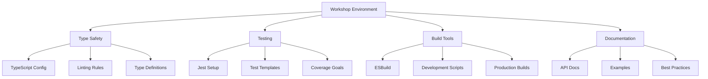
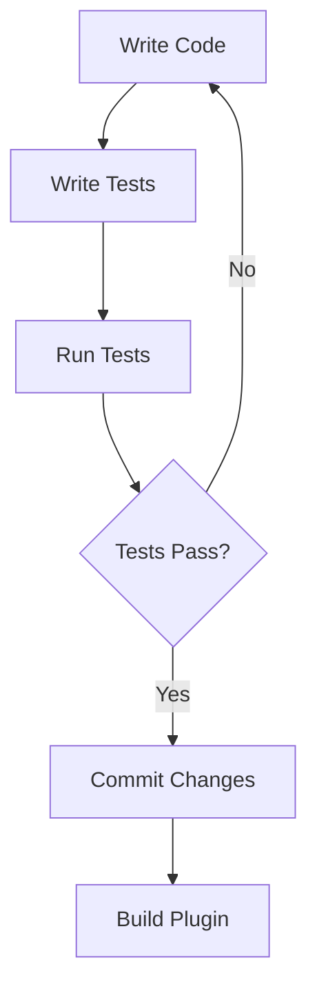

# 🔄 Learning Integration Report

## 📊 Current State Analysis

### Strengths
- Strong AI collaboration guidelines
- Clear project structure
- Comprehensive documentation
- Sample plugin template
- Robust testing infrastructure
- Type-safe development environment

### Areas for Enhancement
- Development automation
- Performance optimization
- Plugin analytics
- Debug tooling

## 🎯 Integration Points

### 1. Development Environment


### 2. Template Enhancements

#### Type Safety
- Implement strict TypeScript configurations
- Add comprehensive type definitions
- Enforce null checks and type guards

#### Testing Infrastructure ✅
- Jest configuration with TypeScript support
- Comprehensive test templates
- Mock implementations for Obsidian APIs
- Coverage reporting and thresholds
- Watch mode for development
- Integration with build process

#### Build Process
- Optimize ESBuild configuration
- Add development scripts
- Implement hot reloading

#### Documentation
- Enhance JSDoc templates
- Add code examples
- Create troubleshooting guides

## 🔄 Implementation Plan

### Phase 1: Foundation ✅
- [x] Basic project structure
- [x] Sample plugin template
- [x] Development guidelines
- [x] AI collaboration rules
- [x] Testing infrastructure
- [x] Type safety configuration

### Phase 2: Enhancement (Current)
- [ ] Build optimization
- [ ] Documentation updates
- [ ] Development scripts
- [ ] Hot reloading

### Phase 3: Advanced Features
- [ ] Performance monitoring
- [ ] Debug tooling
- [ ] CI/CD integration
- [ ] Plugin analytics

## 📈 Best Practice Integration

### Type Safety
```typescript
// Before
function processData(data: any) {
    return data.value;
}

// After
interface DataType {
    value: string;
}

function processData(data: DataType): string {
    return data.value;
}
```

### Error Handling
```typescript
// Before
function handleOperation() {
    doSomething();
}

// After
async function handleOperation(): Promise<void> {
    try {
        await doSomething();
    } catch (error) {
        console.error('Operation failed:', error);
        new Notice('Operation failed. Check console for details.');
    }
}
```

### Testing Pattern
```typescript
// test/main.test.ts
describe('SamplePlugin', () => {
    let plugin: SamplePlugin;
    
    beforeEach(() => {
        plugin = new SamplePlugin(app, manifest);
    });
    
    test('loads settings correctly', async () => {
        await plugin.loadSettings();
        expect(plugin.settings).toBeDefined();
    });
});
```

## 🧪 Testing Infrastructure

### 1. Test Setup
- Jest configuration with TypeScript support
- JSDOM environment for DOM manipulation
- Mocked Obsidian API
- Coverage reporting
- Watch mode for development

### 2. Mock Implementation
- Complete Obsidian API mocks
- Type-safe mock functions
- Customizable mock behaviors
- Reset between tests

### 3. Test Categories
- Unit tests for individual functions
- Integration tests for plugin features
- Settings management tests
- Command handling tests
- Error handling tests

### 4. Coverage Requirements
- 80% minimum coverage
- All critical paths tested
- Error scenarios covered
- Edge cases handled

### 5. Development Workflow


## 🔍 Code Review Guidelines

### Review Checklist
1. Type safety
   - No `any` types
   - Proper interfaces
   - Type guards where needed

2. Error handling
   - Try-catch blocks
   - Error logging
   - User notifications

3. Performance
   - Lazy loading
   - Resource cleanup
   - Memory management

4. Testing
   - Unit tests
   - Integration tests
   - Edge cases
   - Coverage thresholds met

## 📚 Documentation Updates

### API Documentation
- Add comprehensive type information
- Include usage examples
- Document error cases
- Provide troubleshooting guides

### Development Guides
- Setup instructions
- Best practices
- Common patterns
- Troubleshooting
- Testing guidelines

## 🎯 Next Steps

1. **Immediate Actions**
   - [x] Update template configurations
   - [x] Enhance type definitions
   - [x] Add test infrastructure
   - [ ] Improve build process

2. **Short-term Goals**
   - [x] Create example test suite
   - [ ] Add performance monitoring
   - [ ] Enhance documentation
   - [ ] Implement debug tools

3. **Long-term Vision**
   - [ ] Plugin analytics platform
   - [ ] Automated testing
   - [ ] Performance benchmarking
   - [ ] Community guidelines

## 📊 Success Metrics

- Type coverage > 95%
- Test coverage > 80%
- Build time < 2s
- Zero any types
- Comprehensive documentation

## 🔄 Review Cycle

1. Weekly code reviews
2. Monthly best practice updates
3. Quarterly template refresh
4. Annual major version updates

## 🛠️ Development Environment Setup

### Prerequisites
- Node.js
- npm
- Git

### Setup Steps
1. Clone the repository
2. Run setup script: `./scripts/setup-dev-env.sh`
3. Navigate to plugin directory
4. Start development with `npm run dev`

### Available Scripts
- `npm run dev`: Start development mode
- `npm run build`: Build for production
- `npm test`: Run tests
- `npm run test:watch`: Run tests in watch mode
- `npm run test:coverage`: Generate coverage report

Last Updated: 2025-07-09 