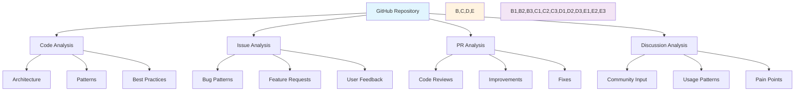
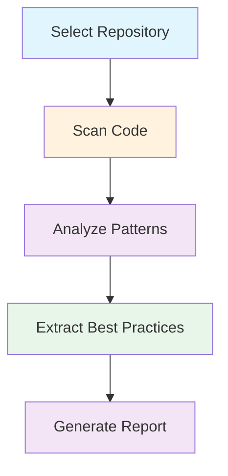
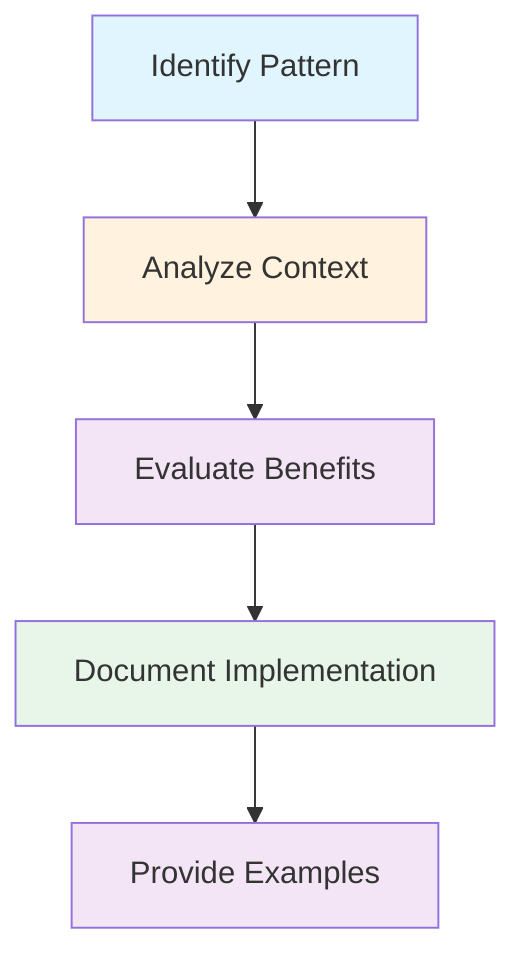

# 🔍 Plugin Analysis System

## 🎯 Analysis Framework

### 1. Repository Analysis


### 2. Analysis Categories

#### Code Structure Analysis
```typescript
interface CodeAnalysis {
  architecture: {
    patterns: string[];
    antiPatterns: string[];
    improvements: string[];
  };
  
  implementation: {
    bestPractices: string[];
    commonPitfalls: string[];
    optimizations: string[];
  };
  
  testing: {
    coverage: number;
    patterns: string[];
    frameworks: string[];
  };
  
  documentation: {
    quality: string;
    completeness: string;
    examples: string[];
  };
}
```

#### Community Feedback Analysis
```typescript
interface CommunityAnalysis {
  issues: {
    common: string[];
    solutions: string[];
    preventions: string[];
  };
  
  features: {
    requested: string[];
    implemented: string[];
    rejected: string[];
  };
  
  feedback: {
    positive: string[];
    negative: string[];
    improvements: string[];
  };
}
```

#### Performance Analysis
```typescript
interface PerformanceAnalysis {
  metrics: {
    loadTime: string;
    memoryUsage: string;
    cpuUsage: string;
  };
  
  optimizations: {
    implemented: string[];
    suggested: string[];
    impact: string[];
  };
  
  bottlenecks: {
    identified: string[];
    resolved: string[];
    pending: string[];
  };
}
```

### 3. Analysis Tools

#### Repository Scanner
```typescript
class RepositoryScanner {
  async scanRepository(url: string): Promise<RepoAnalysis> {
    return {
      code: await this.analyzeCode(),
      issues: await this.analyzeIssues(),
      prs: await this.analyzePRs(),
      discussions: await this.analyzeDiscussions()
    };
  }
  
  private async analyzeCode(): Promise<CodeAnalysis> {
    // Implement code analysis
  }
  
  private async analyzeIssues(): Promise<IssueAnalysis> {
    // Implement issue analysis
  }
  
  private async analyzePRs(): Promise<PRAnalysis> {
    // Implement PR analysis
  }
  
  private async analyzeDiscussions(): Promise<DiscussionAnalysis> {
    // Implement discussion analysis
  }
}
```

#### Pattern Extractor
```typescript
class PatternExtractor {
  extractPatterns(analysis: RepoAnalysis): Pattern[] {
    return [
      ...this.extractCodePatterns(analysis.code),
      ...this.extractIssuePatterns(analysis.issues),
      ...this.extractPRPatterns(analysis.prs)
    ];
  }
  
  private extractCodePatterns(code: CodeAnalysis): Pattern[] {
    // Extract code patterns
  }
  
  private extractIssuePatterns(issues: IssueAnalysis): Pattern[] {
    // Extract issue patterns
  }
  
  private extractPRPatterns(prs: PRAnalysis): Pattern[] {
    // Extract PR patterns
  }
}
```

#### Best Practice Analyzer
```typescript
class BestPracticeAnalyzer {
  analyzeBestPractices(patterns: Pattern[]): BestPractice[] {
    return patterns.map(pattern => ({
      name: pattern.name,
      description: pattern.description,
      context: pattern.context,
      benefits: pattern.benefits,
      implementation: pattern.implementation,
      examples: pattern.examples
    }));
  }
}
```

### 4. Analysis Process

#### Repository Analysis Process


#### Pattern Analysis Process


### 5. Report Generation

#### Analysis Report Template
```markdown
# Plugin Analysis Report

## Overview
- Repository: [URL]
- Analysis Date: [Date]
- Plugin Type: [Type]

## Code Analysis
### Architecture
- Patterns Found:
  - Pattern 1
  - Pattern 2
### Implementation
- Best Practices:
  - Practice 1
  - Practice 2
### Testing
- Coverage: [%]
- Frameworks Used:
  - Framework 1
  - Framework 2

## Community Analysis
### Issues
- Common Problems:
  - Problem 1
  - Problem 2
### Features
- Most Requested:
  - Feature 1
  - Feature 2
### Feedback
- Key Points:
  - Point 1
  - Point 2

## Performance Analysis
### Metrics
- Load Time: [Time]
- Memory Usage: [Usage]
### Optimizations
- Implemented:
  - Optimization 1
  - Optimization 2
### Bottlenecks
- Identified:
  - Bottleneck 1
  - Bottleneck 2
```

### 6. Best Practice Documentation

#### Best Practice Template
```markdown
# Best Practice: [Name]

## Context
[When and where to apply this practice]

## Benefits
- Benefit 1
- Benefit 2

## Implementation
```typescript
// Implementation example
```

## Examples
- Example 1
- Example 2

## Related Patterns
- Pattern 1
- Pattern 2
```

### 7. Usage Guide

#### Analysis Commands
```typescript
// Analyze repository
analyze-repo <url>

// Extract patterns
extract-patterns <analysis-file>

// Generate report
generate-report <patterns-file>

// Update best practices
update-practices <report-file>
```

#### Analysis Workflow
```markdown
1. Select target repository
2. Run repository analysis
3. Extract patterns
4. Analyze best practices
5. Generate report
6. Update documentation
```

### 8. Integration

#### GitHub Integration
```typescript
class GitHubIntegration {
  async fetchRepository(url: string): Promise<RepoData> {
    // Fetch repository data
  }
  
  async fetchIssues(repo: string): Promise<Issue[]> {
    // Fetch issues
  }
  
  async fetchPRs(repo: string): Promise<PR[]> {
    // Fetch PRs
  }
  
  async fetchDiscussions(repo: string): Promise<Discussion[]> {
    // Fetch discussions
  }
}
```

#### Analysis Integration
```typescript
class AnalysisIntegration {
  async integrateAnalysis(analysis: Analysis): Promise<void> {
    await this.updateBestPractices(analysis);
    await this.updateTemplates(analysis);
    await this.updateDocumentation(analysis);
  }
}
```

### 9. Maintenance

#### Update Process
```markdown
1. Regular repository scans
2. Pattern validation
3. Best practice updates
4. Documentation refresh
5. Template updates
```

#### Quality Checks
```markdown
□ Pattern validation
□ Implementation testing
□ Documentation review
□ Example verification
□ Integration testing
```

Remember:
- Regular analysis updates
- Pattern validation
- Documentation maintenance
- Example verification
- Community feedback integration

Last Updated: 2025-07-09 