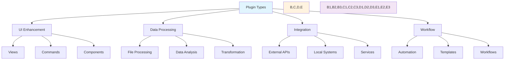

# 🔌 Obsidian Plugin Development Guide

## 🎯 Plugin Development Framework

### 1. Plugin Categories


### 2. Development Patterns

#### UI Enhancement Plugins
```typescript
interface UIPlugin {
  // Core UI components
  view?: View;
  leaf?: WorkspaceLeaf;
  
  // UI state management
  state: {
    data: any;
    settings: any;
  };
  
  // Event handlers
  handlers: {
    onOpen(): void;
    onClose(): void;
    onChange(change: any): void;
  };
  
  // Rendering
  render(): void;
  refresh(): void;
}
```

#### Data Processing Plugins
```typescript
interface DataPlugin {
  // Data handlers
  processors: {
    process(data: any): Promise<any>;
    validate(data: any): boolean;
    transform(data: any): any;
  };
  
  // Error handling
  errorHandling: {
    handleError(error: Error): void;
    recover(state: any): void;
  };
  
  // State management
  state: {
    cache: Map<string, any>;
    settings: any;
  };
}
```

#### Integration Plugins
```typescript
interface IntegrationPlugin {
  // API management
  api: {
    connect(): Promise<void>;
    disconnect(): Promise<void>;
    request(data: any): Promise<any>;
  };
  
  // Data sync
  sync: {
    push(data: any): Promise<void>;
    pull(): Promise<any>;
    validate(): boolean;
  };
  
  // Error handling
  errorHandling: {
    handleApiError(error: Error): void;
    retry(operation: () => Promise<any>): Promise<any>;
  };
}
```

#### Workflow Plugins
```typescript
interface WorkflowPlugin {
  // Workflow management
  workflow: {
    start(): Promise<void>;
    stop(): Promise<void>;
    step(data: any): Promise<any>;
  };
  
  // State tracking
  state: {
    current: string;
    history: string[];
    data: Map<string, any>;
  };
  
  // Event handling
  events: {
    onStep(step: string): void;
    onComplete(): void;
    onError(error: Error): void;
  };
}
```

### 3. Implementation Guidelines

#### Base Plugin Structure
```typescript
class BasePlugin extends Plugin {
  settings: PluginSettings;
  
  async onload() {
    await this.loadSettings();
    this.addSettingTab(new SettingTab(this.app, this));
    this.registerEvents();
    this.initializeFeatures();
  }
  
  async loadSettings() {
    this.settings = Object.assign({}, DEFAULT_SETTINGS, await this.loadData());
  }
  
  async saveSettings() {
    await this.saveData(this.settings);
  }
  
  registerEvents() {
    // Register event handlers
  }
  
  initializeFeatures() {
    // Initialize plugin features
  }
}
```

#### Error Handling Pattern
```typescript
class ErrorHandler {
  static async withErrorHandling<T>(
    operation: () => Promise<T>,
    errorHandler?: (error: Error) => void
  ): Promise<T> {
    try {
      return await operation();
    } catch (error) {
      console.error('Operation failed:', error);
      if (errorHandler) {
        errorHandler(error);
      }
      throw error;
    }
  }
  
  static handleApiError(error: Error) {
    // Handle API specific errors
  }
  
  static handleUIError(error: Error) {
    // Handle UI specific errors
  }
}
```

#### State Management Pattern
```typescript
class StateManager<T> {
  private state: T;
  private history: T[] = [];
  
  constructor(initialState: T) {
    this.state = initialState;
  }
  
  getState(): T {
    return this.state;
  }
  
  setState(newState: T) {
    this.history.push(this.state);
    this.state = newState;
  }
  
  undo() {
    const previousState = this.history.pop();
    if (previousState) {
      this.state = previousState;
    }
  }
}
```

### 4. Testing Framework

#### Unit Testing Template
```typescript
describe('Plugin Tests', () => {
  let plugin: YourPlugin;
  
  beforeEach(() => {
    plugin = new YourPlugin();
  });
  
  describe('Feature Tests', () => {
    test('should handle basic operation', async () => {
      // Test implementation
    });
    
    test('should handle errors', async () => {
      // Error handling test
    });
    
    test('should manage state', () => {
      // State management test
    });
  });
});
```

#### Integration Testing Template
```typescript
describe('Integration Tests', () => {
  let plugin: YourPlugin;
  let app: App;
  
  beforeEach(async () => {
    app = await createMockApp();
    plugin = new YourPlugin(app);
    await plugin.onload();
  });
  
  afterEach(async () => {
    await plugin.onunload();
  });
  
  test('should integrate with app', async () => {
    // Integration test
  });
});
```

### 5. Performance Guidelines

#### Resource Management
```typescript
class ResourceManager {
  private cache: Map<string, any> = new Map();
  private maxSize: number;
  
  constructor(maxSize: number = 100) {
    this.maxSize = maxSize;
  }
  
  set(key: string, value: any) {
    if (this.cache.size >= this.maxSize) {
      const firstKey = this.cache.keys().next().value;
      this.cache.delete(firstKey);
    }
    this.cache.set(key, value);
  }
  
  get(key: string) {
    return this.cache.get(key);
  }
}
```

#### Performance Monitoring
```typescript
class PerformanceMonitor {
  private metrics: Map<string, number[]> = new Map();
  
  startOperation(name: string) {
    const start = performance.now();
    return () => {
      const duration = performance.now() - start;
      const existing = this.metrics.get(name) || [];
      this.metrics.set(name, [...existing, duration]);
    };
  }
  
  getMetrics(name: string) {
    return {
      avg: this.average(name),
      max: this.max(name),
      min: this.min(name)
    };
  }
  
  private average(name: string): number {
    const values = this.metrics.get(name) || [];
    return values.reduce((a, b) => a + b, 0) / values.length;
  }
  
  private max(name: string): number {
    return Math.max(...(this.metrics.get(name) || []));
  }
  
  private min(name: string): number {
    return Math.min(...(this.metrics.get(name) || []));
  }
}
```

### 6. Security Best Practices

#### Data Validation
```typescript
class DataValidator {
  static validateUserInput(input: any): boolean {
    // Implement validation logic
    return true;
  }
  
  static sanitizeInput(input: string): string {
    // Implement sanitization logic
    return input;
  }
  
  static validateApiResponse(response: any): boolean {
    // Implement API response validation
    return true;
  }
}
```

#### Security Patterns
```typescript
class SecurityManager {
  static encryptData(data: any): string {
    // Implement encryption
    return '';
  }
  
  static decryptData(encrypted: string): any {
    // Implement decryption
    return null;
  }
  
  static validatePermissions(operation: string): boolean {
    // Implement permission validation
    return true;
  }
}
```

### 7. Documentation Requirements

#### Code Documentation
```typescript
/**
 * Plugin component description
 * @param {type} name - Parameter description
 * @returns {type} Return value description
 * @throws {ErrorType} Error scenario description
 * @example
 * // Usage example
 * const result = function(param);
 */
```

#### User Documentation
```markdown
# Plugin Name

## Features
- Feature 1
- Feature 2

## Installation
1. Step 1
2. Step 2

## Usage
1. Usage step 1
2. Usage step 2

## Configuration
- Setting 1
- Setting 2

## Troubleshooting
- Issue 1
- Issue 2
```

### 8. Release Process

#### Version Management
```typescript
interface VersionInfo {
  major: number;
  minor: number;
  patch: number;
  
  toString(): string;
  isCompatible(other: VersionInfo): boolean;
}
```

#### Release Checklist
```markdown
1. Update version number
2. Run all tests
3. Update documentation
4. Generate changelog
5. Create release package
6. Test in clean environment
7. Submit for review
```

### 9. Maintenance Guidelines

#### Code Review Checklist
```markdown
□ Type safety
□ Error handling
□ Performance impact
□ Security implications
□ Documentation updates
□ Test coverage
```

#### Update Process
```markdown
1. Review changes
2. Test impacts
3. Update documentation
4. Release updates
5. Monitor feedback
```

Remember:
- Follow type safety
- Handle errors gracefully
- Document everything
- Test thoroughly
- Consider performance
- Maintain security
- Update regularly

Last Updated: 2025-07-09 